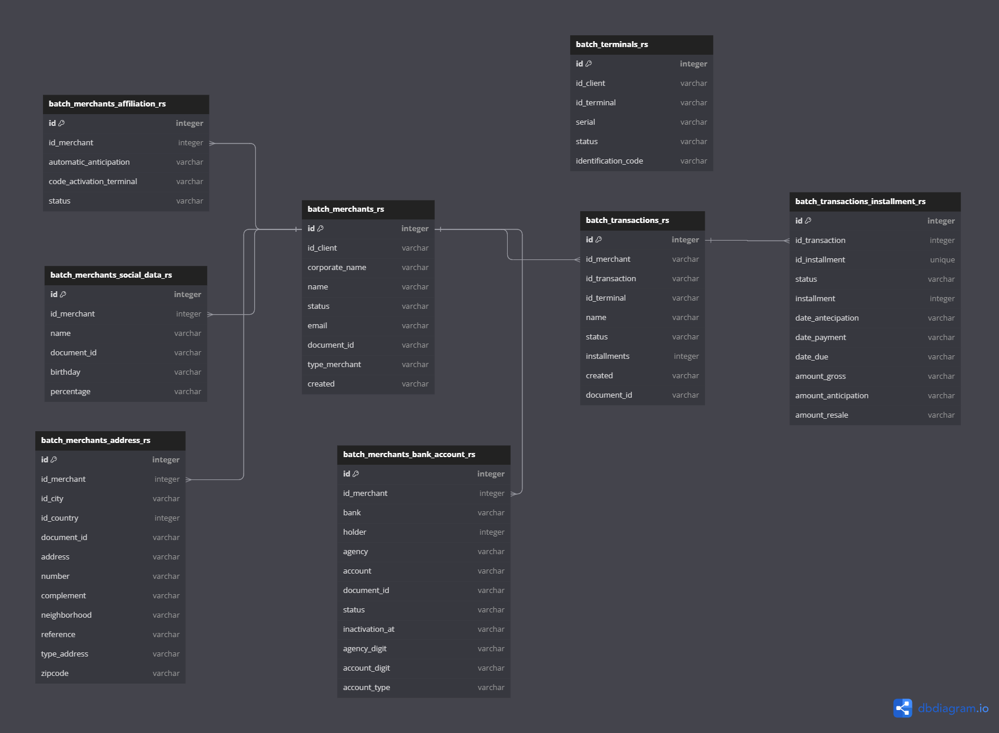

# Request and population Database

## About Server

It's an application designed to retrieve data from the Rs solution API and store it in a personal database, where entity relationships and associations are managed.

# Technologies used
## Back-end
- Python

## Database
- PostgreSQL

## Diagram



## Why Python ?

Python is a highly recommended programming language due to its simple syntax, readability, extensive community, and vast collection of libraries. Its versatility allows it to be used in a variety of domains, from web development and automation to machine learning and artificial intelligence. Moreover, Python is cross-platform, integrable with other languages, and open source, making it a versatile, accessible choice suitable for a wide range of development scenarios.


# How to run the project

prerequisites: 
- Python 3.8 +

Run: 
```bash
# Run aplication
python run.py
```
choice phase:
```bash
# Choose which request method to use
Selecione uma das opções:
Get all data (1)
Get data from the last 2 days(2)
: # Enter one of the two options (1 or 2)
```


